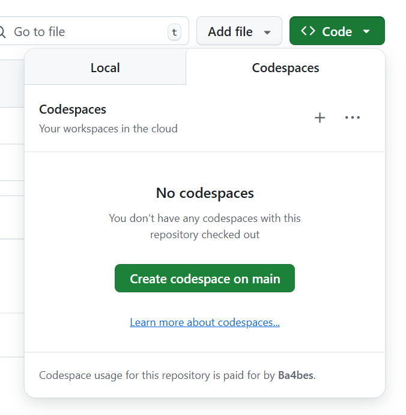

# Lab 0 — Core Guided: Work with a Codespace

**Goal:** Start a Codespace, commit a change, then stop and delete the Codespace.

**Time:** 20 minutes

**You will need:** A GitHub account with Codespaces access (included in the free tier).

---

## Steps

### 1. Create your repo and start a Codespace

1. Open the workshop repo in your browser
2. Click **Use this template** → **Create a new repository**, fill in a repository name, and click **Create repository**
3. In your new repository, click the green **Code** button → **Codespaces** tab → **Create codespace on main**

   

4. Wait for the Codespace to open — this typically takes 60–90 seconds while the container builds

### 2. Run the app

5. Once the terminal prompt appears, start the API for your chosen language:

   **Node:**
   ```bash
   cd node && npm start
   ```

   **Python:**
   ```bash
   cd python && flask run --port 5000
   ```

   **.NET:**
   ```bash
   cd dotnet && dotnet run
   ```

6. A notification appears at the bottom-right of the screen when the port is forwarded

   

7. Click **Open in Browser** to open the app in a new tab and confirm it is running

### 3. Commit a change

8. Open `README.md` in the editor
9. Add your name to the top of the file
10. Open the **Source Control** panel from the left sidebar (or press `Ctrl+Shift+G`)
11. Stage the change, add a commit message such as `Add name to README`, and click **Commit**
12. Click **Sync Changes** to push the commit to your repository
13. Open your repository on GitHub.com in a browser tab and confirm the change is visible in `README.md`

### 4. Stop and delete the Codespace

14. Go back to your repository on GitHub.com in your browser
15. Click the green **Code** button → **Codespaces** tab
16. Click the **...** menu next to your running Codespace and select **Stop codespace**

> Note: you don't need to stop the codespace before deleting it. This exersize is just to prove tpoint that you can stop and restart a codespace without losing your work. If you want to see the difference, make a change in your codespace, stop it and then start it again. You'll see that your change is still there. If you had deleted the codespace instead, that change would be lost.
> 
17. Once it has stopped, click the **...** menu again and select **Delete**

**Expected result:** The change is committed, pushed, and visible in the repo. The Codespace is stopped and deleted.

> **Troubleshooting:** If the port notification does not appear, open the **Ports** tab at the bottom of the Codespace, find the forwarded port, and click the globe icon to open it in a browser tab.
