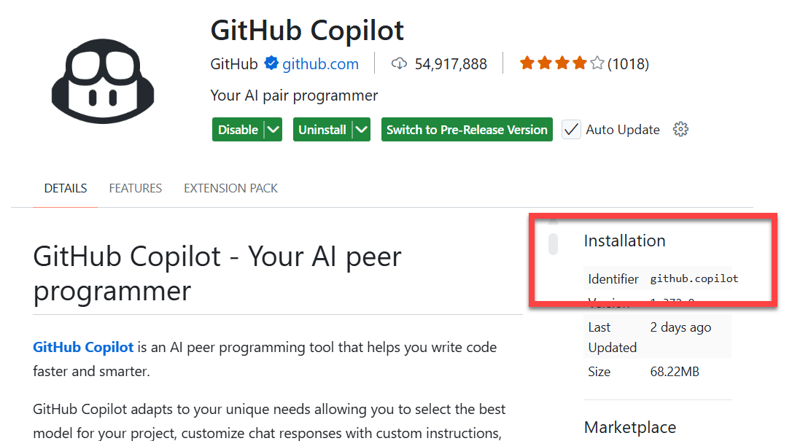
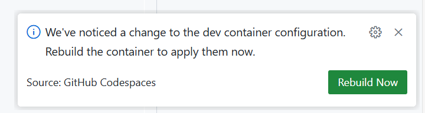

# Lab 0 — Challenge Guided: Customize Your Dev Container

**Goal:** Add a VS Code extension, a CLI tool, and a VS Code setting to the devcontainer configuration.

**Time:** 25 minutes

**You will need:** Lab 0 Core completed (you have a Codespace running).

---

## Steps

### 1. Open a new Codespace

1. Go to your repository on GitHub.com
2. Click the green **Code** button → **Codespaces** tab → **Create codespace on main**

   

3. Wait for the Codespace to open, then open `.devcontainer/devcontainer.json`

   You can also open the Command Palette (`Ctrl+Shift+P`) and run **Dev Containers: Add Dev Container Configuration Files...** if the file does not exist yet:

   

### 2. Add the GitHub Copilot extension

4. Locate the `customizations.vscode.extensions` array and add `"github.copilot"` to it

   To find the identifier for any extension, open it in the Extensions sidebar or on the VS Code Marketplace and look for the **Identifier** field in the installation details panel:

      


   

5. Save the file. A notification will appear asking if you want to rebuild. Click **Rebuild Now**
6. 
   

   Wait for the rebuild to complete, then verify the **GitHub Copilot** extension appears in the Extensions sidebar.

### 3. Add the Azure CLI feature

6. Open `.devcontainer/devcontainer.json` again and add the Azure CLI entry to the `"features"` section:

   ```json
   "ghcr.io/devcontainers/features/azure-cli:1": {}
   ```

   Dev container features are pre-built scripts that install tools into the container. You can find the full list at [containers.dev/features](https://containers.dev/features).

7. Save the file and click **Rebuild Now** when the notification appears

   Wait for the rebuild to complete, then open a new terminal and run `az --version` to verify the Azure CLI is installed.

### 4. Add a VS Code setting to hide the minimap

8. In `customizations.vscode`, add (or update) a `"settings"` section:

   ```json
   "settings": {
     "editor.minimap.enabled": false
   }
   ```

9. Save the file and click **Rebuild Now** when the notification appears

   Wait for the rebuild to complete, then open any source file and confirm the minimap on the right side of the editor is gone.

**Expected result:** All three customizations are active after their respective rebuilds — the GitHub Copilot extension is installed, `az --version` works in the terminal, and the minimap is hidden.

> **Tip:** VS Code settings placed in `devcontainer.json` apply to everyone who opens the repo in a Codespace. This is a great way to enforce consistent editor behaviour across a team.
